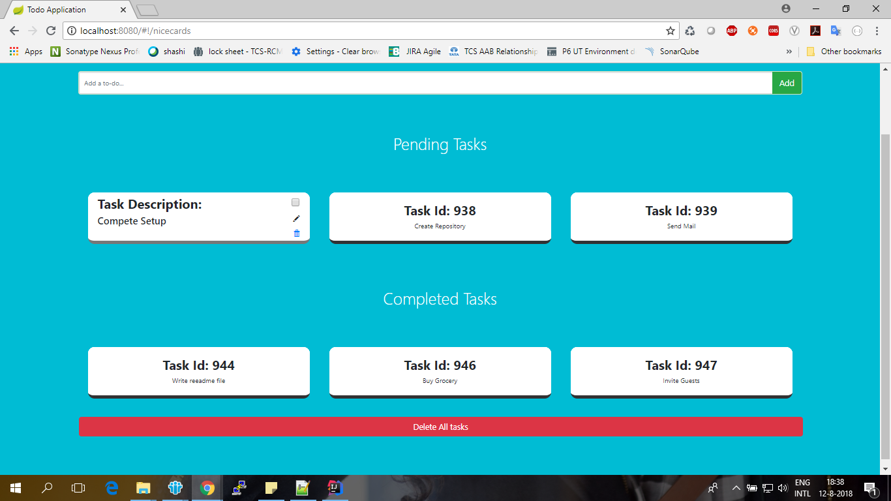

# Todo Application
This is a sample application about Spring Boot, AngularJS, Maven, Embedded Database(H2),Unit Test & Integration Test etc

run
``
mvn spring-boot:run
``
to start the application and then hit
http://localhost:8080 in the browser and enjoy you own TODO app.

On Mouse hover on the cards, you will be able to see options to edit description, delete the task or mark it as done.
Please refer below sample screenshot, cursor is pointed on first task in pending list, hence it is showing the back of the card

